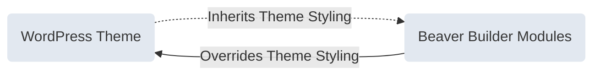

<head>
  <body className="mermaid-module-diagram" />
</head>

Beaver Builder is equipped with an extensive collection of modules that provide users with a wide range of options to create and design websites that cater to their needs and preferences.

## What are Modules?

In Beaver Builder, modules are building blocks that contain content and can be added to any column. These modules are similar to WordPress widgets, but provide more advanced customization and styling choices. Each module serves a specific purpose, such as text, images, videos, buttons, and more. You can configure and arrange each module to create unique designs and layouts without requiring any coding experience.

:::tip
You can [override modules](/beaver-builder/developer/custom-modules/18-override-modules.md) to add custom functionality, as well as create custom modules using our API. For more information, refer to the [Custom Module API](/beaver-builder/developer/custom-modules/index.md) developer article.
:::

### Inherit Styling

In order to ensure consistent color and typography, Beaver Builder modules follow a cascading inheritance model whereby they inherit the styling provided by the current theme. This means that when users add headings or text to layouts using modules such as the Heading or Text modules, they will automatically adopt the heading and text styling of the theme.

You can override this behavior by using the module styling options. For instance, if a user adds a Heading module to their layout, they can adjust the heading font size or change the heading text color using the Heading module styling options.

The following diagram provides a visual representation of how the process works.

## Access Modules

1. Launch Beaver Builder on your page or post.

2. On the **Top bar**, click the Plus symbol **(+)** to open the **Content Panel**.

3. Click the **Modules tab** to access all **Standard Modules**.

### Module Subgroups

Beaver Builder groups modules into different subgroups for better organization. These subgroups can be accessed via the Modules group dropdown menu. There may also be subgroups of third-party modules, depending on other plugins you have installed.

The following are the different module subgroups available.

- **Standard Modules**  
  All modules included with Beaver Builder are listed in the Standard Modules group. If you disable modules via the Beaver Builder settings, they do not appear in the Standard Modules group.

- **ACF Blocks**  
  If you have the [Advanced Custom Fields](https://www.advancedcustomfields.com/) plugin installed, any ACF blocks you create will appear in the ACF Blocks group.

- **WordPress Patterns** (Reusable Blocks)  
  Any [WordPress Patterns](https://wordpress.org/support/article/reusable-blocks/) (Reusable Blocks) created will appear in the WordPress Patterns group.

- **Themer Modules**  
  The **Themer Modules** subgroup displays a list of all Beaver Themer modules that are available when using the builder on a Beaver Themer layout.

- **WordPress Widgets**  
  Most WordPress widgets, including third-party ones, can be integrated into your Beaver Builder layout. Third-party widgets, however, may require custom code to work properly.

  See the [WordPress Widgets](widgets.md) article for more information.

- **Saved Modules**  
  Any modules [saved for reuse](#saved-modules) will appear in the **Saved Modules group**, this includes [global modules](#global-saved-module) as well.

## Add Modules

1. Click the Plus symbol **(+)** to open the **Content Panel**.

2. Click the **Modules tab** to access all modules.

3. Drag and drop the module you want to use into our layout.

## Module Settings

1. Move your mouse cursor over the module you want to configure.

2. In the Module overlay actions click the **Wrench** <i className="fas fa-wrench"></i> icon.

3. Configure the module according to your preferences in the module settings window.

4. Click **Save** when you're happy with your changes.

:::tip

You can also access the module settings by [right-clicking on the module in the Outline Panel](user-interface/outline-panel.md#right-click).

:::

## Move modules

Modules can be moved from one column to another or be used to create a new column.

1. Move your mouse cursor over the module you want to move.

2. In the Module overlay actions click and hold the **Move** <i className="fas fa-arrows-alt"></i> icon.

3. Drag the module to move to another position in your layout.

## Delete modules

1. Move your mouse cursor over the module you want to delete.

2. In the Module overlay actions click the **Close** <i className="fas fa-times"></i> icon to delete the module.

3. Verify that you want to remove the module.

## In this section:

import DocCardList from '@theme/DocCardList';

<DocCardList />
