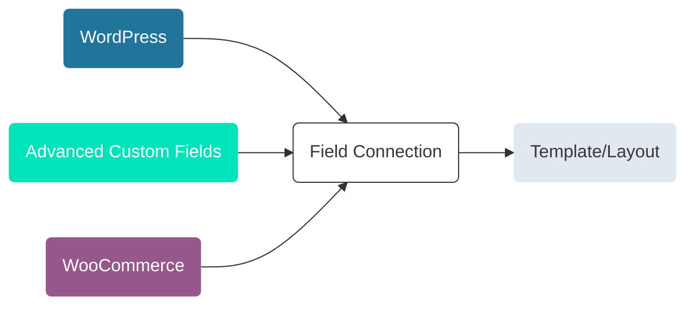
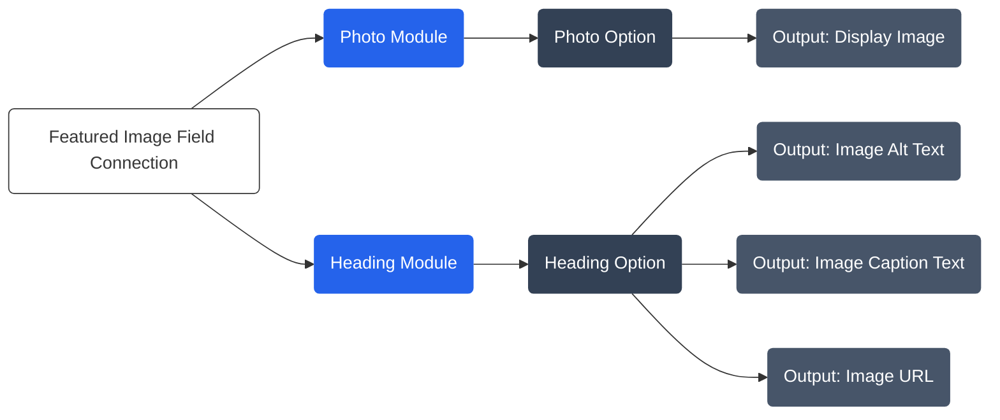

Field connections enable you to seamlessly retrieve data from your website's WordPress database and effortlessly integrate it into designated row, column, and module options, presenting the data beautifully within your Beaver Themer layouts.

The versatility of these connections allows data extraction from a multitude of sources, including WordPress data, WordPress custom fields, and popular plugins like Advanced Custom Fields, Big Commerce, Easy Digital Downloads, The Events Calendar, and WooCommerce.

Furthermore, field connections extend their support to [shortcodes](syntax.md), granting you the flexibility to apply them not only within row, column, or module options but also throughout your entire layout wherever text can be inserted. This includes areas like within an HTML module or the custom layout option for the Post module.

*Note: The above diagram showcases WordPress, Advanced Custom Fields and WooCommerce as data sources, but field connections can also be used with other supported plugin, such as BigCommerce, Easy Digital Downloads, and The Events Calendar.*

## Why use Field Connections?

Field Connections allow you to streamline your workflow by eliminating the need to create separate layouts for individual posts or pages. Instead, you can create one singular layout, assign this to all posts on your website and use field connections to dynamically display the correct data for each post or page.

## Data Sources & Natively Supported Plugins

Field Connections natively support the following data sources and plugins.

* [WordPress Data](wordpress-data.md)
* [WordPress Custom Fields](wordpress-custom-fields.md)
* [Advanced Custom Fields](../integrations/acf/index.md)
* [BigCommerce](../integrations/bigcommerce/field-connections.md)
* [Easy Digital Downloads](../integrations/easy-digital-downloads/field-connections.md)
* [The Events Calendar](../integrations/tec/field-connections.md)
* [WooCommerce](../integrations/woocommerce/field-connections.md)

Toolset custom fields are fully compatible and function in a manner similar to WordPress custom fields. However, to utilize Toolset custom fields effectively, it is necessary to prefix your field's name (key) with `wpcf-`.

* [Toolset](third-party-integrations.md#toolset)

Additionally, third-party plugins like Pods, and Meta Box have integrated their own field connections, ensuring smooth compatibility with Beaver Themer.

* [Meta Box](third-party-integrations.md#metabox)
* [Pods](third-party-integrations.md#pods)

## Data Types

When applying field connections to options, ensuring the data type aligns with the intended option is crucial. This ensures that the option you are connecting can accurately output the data.

For example, when using a field connection that outputs an image, like the Featured Image field connection, it should be applied to an option that can display images, such as the option found in the Photo module. If you attempt to apply the Featured Image field connection to a text option, like those present in the Header and Text modules, the connection can still be made. But, you will only be able to output details about the image, such as URL, Title, Caption, Description, or Alt Text, as these details can be presented as text.

## Theme Data

Due to variations in how each theme manages customizer settings, it is not possible to utilize field connections for outputting theme data from the WordPress Customizer settings.

:::tip
An alternative is to utilize the Advanced Custom Fields (ACF) Options Page feature, which allows you to create an additional admin page in your WordPress Dashboard. Any fields you include on the Options Page become global, meaning the data can be accessed and used throughout your entire website.

See the [ACF Options Page](integrations/acf/options-page.md) article for more information.
:::

## WordPress Multisite Support

Field Connection are supported in [WordPress Multisite Network](https://wordpress.org/support/article/create-a-network/) installations. However, it is important to be aware that these field connections cannot be used to retrieve data between sub-sites.

For instance, if you have a WordPress Multisite network with three sub-sites - Site A, Site B, and Site C - using field connections, you cannot retrieve data from Site A and display it on Site B or Site C. The data retrieval is limited to within each individual sub-site and cannot be extended across the network.

## In this Section

import DocCardList from '@theme/DocCardList';

<DocCardList />
